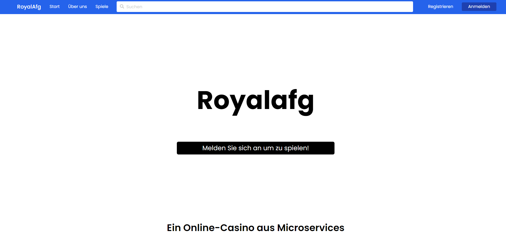

<h1 align="center">RoyalAfg - Online Casino</h1>

	RoyalAfg is a online casino developed using react <a href="https://nextjs.org/">Nextjs</a> and <a href="https://golang.org/">Go</a>
  <i>It was designed in an microservice architecture
     for a <b>special learning achievement.</b></i>
   

***The submitted version of this project is found in the release_01 branch***

## Documentation

To run individual services review the build and run guide of your choosing.

 - [Motivations](#motivations)
 - [Getting Started](#Installation)
 - [Architecture](#architecture)

For a complete deployment see this.
 - [Deploy](#Deploy)
 
 ## Motivations
 While this is a project for a special learning achievement (a NRW thing for the german abitur), it also serves as a full example of a Kubernetes and microservice oriented application because i did not see many of these.

A online casino is a perfect example for a microservice architecture, because many services need to communicate with each other, which is the main problem of this pattern. In addition it is a complex enough system that meaningful real world examples can be created and shown. Furthermore do game servers show how different requirements can be managed in Kubernetes. 

Though I have plans to keep this to a best of recommendet practices that seem like a good idea. I plan to develop a working devops process with Jenkins CI (or other CI) and ArgoCd that is quickly deployable with terraform and or Ansible.

## Installation
### Bazel
This project can be build with [Bazel](https://bazel.build/) tools, which create a sandbox to compile the source code. This should and can significantly speed up compile and test times though not realy at this project scale without dedicated compile servers and chaches. 

**_I recommend especially for starters to scroll down for the standard go compiler._**

The authentication service would be build using the following output

	#Builds the authentication service
	bazel build //services/auth:auth
	
	#Run the authentication service (does not 
	require the previous step)
	bazel run //services/auth:auth
	
if you want to specify the configuration used by the service you can set the `--config` Flag like this
	
	bazel run //services/auth:auth --config=./pathToYourConfig
	
Bazel is able to build directly to containers from the source code.
This can be done using the 

	bazel build //services/auth:image --platforms=@io_bazel_rules_go//go/toolchain:linux_amd64

Notice that the `--platform` is important to tell Bazel that the go code should be compiled for the Linux runtime, since the Container's operating system is Alpine Linux.

### Standard Go Compiler
Apart from the  [Bazel](#Bazel) build tool every service can be build using the standard go tools
	
	#Build authentication service
	go build ./services/auth/main.go
	
	#Run the service
	go run ./serivces/auth/main.go --config=./pathToConfig
	
### Build the docker image
The Docker file in the root directory can accommodate every go service of the system.
To specify a service to be build to an Docker image use the following command

	docker build -t royalafg_auth --build-arg service=./services/auth/main.go .

This will create the Docker image with the tag of `royalafg_auth`. Run `docker run royalafg_auth` to run the application

But the usage of the build argument tag from docker is not at all what it was designed for and it only works in this scenario because all microservices are written in Go and can be compiled by the same Docker instructions other than the directories of the source files.

Because this is not a very elegant solution this will likely change in the future.

## Deploy
I publish each service as a docker container in my [docker hub page](https://hub.docker.com/u/johnnys318). This is used by the deployment scripts aswell.

To deploy the application please refer to the [DEPLOY.md](https://github.com/JohnnyS318/RoyalAfg/tree/master/deployments/DEPLOY.md) under /deployments

### The following script is not ready yet.

 

To deploy the application on linux simply run
	
	make deploy

which should deploy each service configured with default configuration. **Keep in mind this also includes encryption keys and other private keys. Only use it for testing purposes**

This script has the follwing requirements:

 - access to a terminal
 - docker installed
 - [minikube](https://minikube.sigs.k8s.io/docs/) installed. (On Linux the `docker` or `none` options are available to prevent the extra virutal machine)
 - [kubectl](https://kubernetes.io/de/docs/tasks/tools/install-kubectl/) installed (comes with minikube)
 - [Helm](https://helm.sh/) installed

It will fire of a new minikube instance, which will configure kubectl and helm and the deploy the deployments described in `/deployments` in the correct order. In addition to that it will add the required helm repositories and install them. This includes [Agones](https://agones.dev/site/) .

## Architecture
Following services are integrated into the system:

 - [Auth](https://github.com/JohnnyS318/RoyalAfg/tree/master/services/auth)
 - [User](https://github.com/JohnnyS318/RoyalAfg/tree/master/services/user)
 - [Bank](https://github.com/JohnnyS318/RoyalAfg/tree/master/services/bank)
 - [Poker-Matchmaker](https://github.com/JohnnyS318/RoyalAfg/tree/master/services/poker-matchmaker)
 - [Poker](https://github.com/JohnnyS318/RoyalAfg/tree/master/services/poker)
 - [Search](https://github.com/JohnnyS318/RoyalAfg/tree/master/services/search)
 - [Docs](https://github.com/JohnnyS318/RoyalAfg/tree/master/services/docs)
 - [Web](https://github.com/JohnnyS318/RoyalAfg/tree/master/services/web)

## Auth
The authentication service is responsible to generate authentication tokens (jwt) and verify and extend these tokens.
It is very dependent on the user service and communicates with it over a GRPC API. Because all data of the authentication service is transient and valuable data is sent to the user service it does not need a seperat database. Every newly registered account is notifiing the reddit message queue.

## User
The user service is the governing body on the users data. It uses mongodb to persist this data and has grpc and http endpoint to enable communication. It caches recently requested users to speed up the recuring requests.

## Bank
The bank service creates a bank account for every user. It tracks every transaction and uses a event sourced system to ensure the safety and reliability of the system. It uses the message bus to subscribe to meaningful events and safe them to the event store.

## Search
The search service uses elasticsearch to provide search functionality for the front end. It only communicates over http

## Web
The front end of the casino. It is written with nextjs which gives it the flexability to do ssr for seo and spa for gaming related pages seamingly without much effort.

## Poker-Matchmaker
The Matchmaker for the poker game.
It is responsible to verify the buy in and to generate tickets to individual gameservers. It is in contact with the agones system which manages the gameservers in a special kubernetes realm

## Poker
The Poker Gameserver provides a websocket connection to the poker game functionality. The lifecycle of the gameserver is determined by the Agones Gameserver management system.

## Docs
A API documentation website generated by swagger docs.

# License
This code is licensed under an MIT license. Ⓒ Jonas Schneider
It is free to use and to manipulate and especially to learn from just like i did...